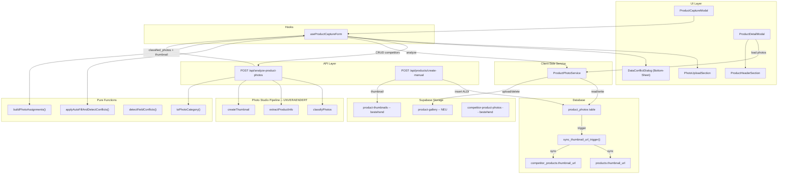

# Produktfotos: Multi-Photo Management (v5 -- konsolidiert)

## Aenderungen gegenueber v4

|     |                                                                               |                     |                                                                                                                      |
| --- | ----------------------------------------------------------------------------- | ------------------- | -------------------------------------------------------------------------------------------------------------------- |
| Nr  | Aenderung                                                                     | Quelle              | Begruendung                                                                                                          |
| 1   | `syncThumbnailUrl` als **DB-Trigger** statt Application-Code                  | Review 1+2          | Eliminiert Desync-Risiko architektonisch; deckt auch Legacy-Routen ab                                                |
| 2   | `storage_bucket` + `storage_path` Spalten statt URL-Parsing/`source`          | Review 2            | Robuster als URL-Parsing; macht Delete/Move zuverlaessig                                                             |
| 3   | `/api/product-photos`-Route **gestrichen**                                    | Review 1            | Unnoetige Schicht; Client-Side Service reicht fuer Competitor; ALDI bleibt Server-seitig (mixed pattern beibehalten) |
| 4   | Konflikt-Dialog **vereinfacht** (Bulk-Default + optionale Felddetails)        | Review 1+2          | Pro-Feld-Default ist mobile-UX-feindlich; 90% der Faelle brauchen nur 1 Klick                                        |
| 5   | `toPhotoCategory` **gehaertet** (`shelf`/`other`/`barcode` explizit abfangen) | Review 2            | Verhindert stille Fehlklassifikation                                                                                 |
| 6   | RLS-Policies **restriktiver**                                                 | Review 2            | Professionelle Standards verlangen engere Kontrolle                                                                  |
| 7   | Phasen **neu geordnet** (Bugfixes + Refactoring vor Feature-Code)             | Review 1+2          | Saubere Codebasis vor Erweiterung                                                                                    |
| 8   | Risiken R9-R13 **ergaenzt**                                                   | Review 1+2          | Orphaned Files, Concurrent Edit, Legacy-Desync, offene RLS, Offline-UX                                               |
| 9   | Edit-Modus unterstuetzt **Batch-Upload**                                      | Nutzer-Entscheidung | Konsistenter mit Create-Flow                                                                                         |
| 10  | Mutationsgrenze: **Mixed** (ALDI via Server, Competitor via Client)           | Nutzer-Entscheidung | Beibehalten wie bisher                                                                                               |
| 11  | UI-Label: **"Hauptbild"** statt "Thumbnail"                                   | Review 1+2          | Nutzer-verstaendlich                                                                                                 |
| 12  | Hook-Zerlegung: reine Funktionen + I/O in Service                             | Review 1            | `compressAndAnalyze` und `uploadOriginalPhotos` sind keine "Helpers"                                                 |

---

## Ist-Zustand (unveraendert gegenueber v4)

- **products**: `thumbnail_url`, `thumbnail_back_url` (max 2 Fotos, Bucket `product-thumbnails`, nur server-side Upload)

- **competitor_products**: `thumbnail_url`, `other_photo_url` (max 2 Fotos, Bucket `competitor-product-photos`, client-side Upload)

- Photo-Studio-Pipeline klassifiziert als `product_front`, `product_back`, `product_side`, `price_tag`, `barcode`, `shelf`, `other` -- bleibt **komplett unveraendert**

- Pipeline gibt nur 1 freigestelltes Thumbnail zurueck, keine Originalfotos

- Upload ist Batch-basiert (1-8 Fotos), AI extrahiert Daten und erstellt Thumbnail

- Im Edit-Modus werden keine bestehenden Fotos angezeigt

- Bestehende Bugs: Memory Leak (Preview-URLs nicht revoked), kein Abort beim Modal-Schliessen

## Soll-Zustand (verfeinert)

- Bis zu **5 Fotos** pro Produkt: 1 Hauptbild + 3 Produktfotos + 1 Preisschild

- Automatische Klassifizierung durch AI, **mit manuellem Korrekturpfad** (Kategorie-Korrektur)

- Fotos sortiert: Hauptbild | Produktfotos | Preisschild

- Fotos im Edit-Dialog sichtbar, loeschbar, ersetzbar, **Batch-Upload auch im Edit-Modus**

- **Vereinfachter** Konflikt-Dialog (Bulk-Entscheidung als Default, Feld-Details optional)

- **DB-Trigger** fuer `thumbnail_url`-Sync (keine manuelle `syncThumbnailUrl`-Aufrufe im Application-Code)

- Bestehende Bugs gefixt

## Blast-Radius-Analyse (validiert: ~35 Dateien)

Die alten Spalten (`thumbnail_url`, `thumbnail_back_url`, `other_photo_url`) bleiben als Sync-Cache bestehen. Dadurch brauchen ~35 Konsumenten keine Aenderung. Nur **4 Stellen** lesen direkt aus `product_photos`: Detail-Ansicht, Edit-Dialog, Photo Service, `create-manual`-Route.

---

## Phase 1: Datenbank + Storage

### 1a. Neue Tabelle `product_photos`

**Neue Datei**: `supabase/migrations/20260312100000_product_photos.sql`

```sql
CREATE TABLE product_photos (
  id UUID PRIMARY KEY DEFAULT gen_random_uuid(),
  product_id UUID REFERENCES products(product_id) ON DELETE CASCADE,
  competitor_product_id UUID REFERENCES competitor_products(product_id) ON DELETE CASCADE,
  photo_url TEXT NOT NULL,
  storage_bucket TEXT NOT NULL,
  storage_path TEXT NOT NULL,
  category TEXT NOT NULL CHECK (category IN ('thumbnail', 'product', 'price_tag')),
  sort_order SMALLINT NOT NULL DEFAULT 0,
  created_at TIMESTAMPTZ NOT NULL DEFAULT now(),
  CONSTRAINT exactly_one_product CHECK (
    (product_id IS NOT NULL)::int + (competitor_product_id IS NOT NULL)::int = 1
  )
);
```

**Aenderung v4 -> v5**: `source`-Spalte entfernt, dafuer `storage_bucket` + `storage_path`. Macht Delete zuverlaessig ohne URL-Parsing.

**Partial Unique Indices** (max 1 Thumbnail, max 1 Preisschild pro Produkt):

```sql
CREATE UNIQUE INDEX uq_pp_thumb_aldi ON product_photos (product_id)
  WHERE category = 'thumbnail' AND product_id IS NOT NULL;
CREATE UNIQUE INDEX uq_pp_thumb_comp ON product_photos (competitor_product_id)
  WHERE category = 'thumbnail' AND competitor_product_id IS NOT NULL;
CREATE UNIQUE INDEX uq_pp_price_aldi ON product_photos (product_id)
  WHERE category = 'price_tag' AND product_id IS NOT NULL;
CREATE UNIQUE INDEX uq_pp_price_comp ON product_photos (competitor_product_id)
  WHERE category = 'price_tag' AND competitor_product_id IS NOT NULL;
```

**5-Foto-Limit per DB-Trigger** (unveraendert):

```sql
CREATE OR REPLACE FUNCTION check_product_photo_limit() RETURNS TRIGGER AS $$
DECLARE photo_count INT;
BEGIN
  IF NEW.product_id IS NOT NULL THEN
    SELECT COUNT(*) INTO photo_count FROM product_photos WHERE product_id = NEW.product_id;
  ELSE
    SELECT COUNT(*) INTO photo_count FROM product_photos WHERE competitor_product_id = NEW.competitor_product_id;
  END IF;
  IF photo_count >= 5 THEN
    RAISE EXCEPTION 'Maximal 5 Fotos pro Produkt erlaubt';
  END IF;
  RETURN NEW;
END;
$$ LANGUAGE plpgsql;

CREATE TRIGGER trg_product_photo_limit BEFORE INSERT ON product_photos
  FOR EACH ROW EXECUTE FUNCTION check_product_photo_limit();
```

**Lookup-Indices** (unveraendert):

```sql
CREATE INDEX idx_pp_aldi ON product_photos (product_id) WHERE product_id IS NOT NULL;
CREATE INDEX idx_pp_comp ON product_photos (competitor_product_id) WHERE competitor_product_id IS NOT NULL;
```

### 1b. Thumbnail-Sync-Trigger (NEU in v5)

**Aenderung v4 -> v5**: `syncThumbnailUrl` wird als DB-Trigger implementiert statt als Application-Code. Dadurch ist die Konsistenz architektonisch garantiert, nicht per Konvention.

```sql
CREATE OR REPLACE FUNCTION sync_thumbnail_url_trigger() RETURNS TRIGGER AS $$
DECLARE
  target_product_id UUID;
  target_competitor_id UUID;
  thumb_url TEXT;
BEGIN
  target_product_id := COALESCE(NEW.product_id, OLD.product_id);
  target_competitor_id := COALESCE(NEW.competitor_product_id, OLD.competitor_product_id);

  IF target_product_id IS NOT NULL THEN
    SELECT photo_url INTO thumb_url FROM product_photos
      WHERE product_id = target_product_id AND category = 'thumbnail' LIMIT 1;
    UPDATE products SET thumbnail_url = thumb_url
      WHERE product_id = target_product_id;
  END IF;

  IF target_competitor_id IS NOT NULL THEN
    SELECT photo_url INTO thumb_url FROM product_photos
      WHERE competitor_product_id = target_competitor_id AND category = 'thumbnail' LIMIT 1;
    UPDATE competitor_products SET thumbnail_url = thumb_url
      WHERE product_id = target_competitor_id;
  END IF;

  RETURN COALESCE(NEW, OLD);
END;
$$ LANGUAGE plpgsql;

CREATE TRIGGER trg_sync_thumbnail
  AFTER INSERT OR UPDATE OR DELETE ON product_photos
  FOR EACH ROW EXECUTE FUNCTION sync_thumbnail_url_trigger();
```

### 1c. RLS-Policies (gehaertet in v5)

**Aenderung v4 -> v5**: Restriktivere Policies. Delete nur fuer eigene Fotos (ueber Produkt-Ownership). Da die App aber kein user_id auf `product_photos` hat und die Produkttabellen auch keine Ownership kennen, bleibt die Einschraenkung pragmatisch auf `authenticated`. Zusaetzlich: expliziter Kommentar, dass dies bewusst so gewaehlt ist (wenige Nutzer, geschlossene App).

```sql
ALTER TABLE product_photos ENABLE ROW LEVEL SECURITY;

-- Lesen: public (konsistent mit products-Tabelle)
CREATE POLICY "Public read product_photos" ON product_photos
  FOR SELECT TO anon, authenticated USING (true);

-- Schreiben: nur authentifiziert
-- Anmerkung: Kein user_id-Filter da products/competitor_products ebenfalls
-- keine Ownership haben. Akzeptables Risiko fuer wenige Nutzer.
CREATE POLICY "Auth insert product_photos" ON product_photos
  FOR INSERT TO authenticated WITH CHECK (true);
CREATE POLICY "Auth update product_photos" ON product_photos
  FOR UPDATE TO authenticated USING (true);
CREATE POLICY "Auth delete product_photos" ON product_photos
  FOR DELETE TO authenticated USING (true);
```

### 1d. Neuer Storage-Bucket `product-gallery` (unveraendert)

```sql
INSERT INTO storage.buckets (id, name, public) VALUES ('product-gallery', 'product-gallery', true);
CREATE POLICY "Auth upload product-gallery" ON storage.objects
  FOR INSERT TO authenticated WITH CHECK (bucket_id = 'product-gallery');
CREATE POLICY "Public read product-gallery" ON storage.objects
  FOR SELECT TO anon, authenticated USING (bucket_id = 'product-gallery');
CREATE POLICY "Auth update product-gallery" ON storage.objects
  FOR UPDATE TO authenticated USING (bucket_id = 'product-gallery');
CREATE POLICY "Auth delete product-gallery" ON storage.objects
  FOR DELETE TO authenticated USING (bucket_id = 'product-gallery');
```

### 1e. Datenmigration bestehender Fotos (angepasst fuer `storage_bucket`/`storage_path`)

```sql
-- ALDI Thumbnails
INSERT INTO product_photos (product_id, photo_url, storage_bucket, storage_path, category, sort_order)
SELECT product_id, thumbnail_url,
  'product-thumbnails',
  regexp_replace(thumbnail_url, '^.*/product-thumbnails/', ''),
  'thumbnail', 0
FROM products WHERE thumbnail_url IS NOT NULL;

-- ALDI Back-Fotos
INSERT INTO product_photos (product_id, photo_url, storage_bucket, storage_path, category, sort_order)
SELECT product_id, thumbnail_back_url,
  'product-thumbnails',
  regexp_replace(thumbnail_back_url, '^.*/product-thumbnails/', ''),
  'product', 1
FROM products WHERE thumbnail_back_url IS NOT NULL;

-- Competitor Thumbnails
INSERT INTO product_photos (competitor_product_id, photo_url, storage_bucket, storage_path, category, sort_order)
SELECT product_id, thumbnail_url,
  'competitor-product-photos',
  regexp_replace(thumbnail_url, '^.*/competitor-product-photos/', ''),
  'thumbnail', 0
FROM competitor_products WHERE thumbnail_url IS NOT NULL;

-- Competitor Other Photos
INSERT INTO product_photos (competitor_product_id, photo_url, storage_bucket, storage_path, category, sort_order)
SELECT product_id, other_photo_url,
  'competitor-product-photos',
  regexp_replace(other_photo_url, '^.*/competitor-product-photos/', ''),
  'product', 1
FROM competitor_products WHERE other_photo_url IS NOT NULL;
```

### 1f. Beziehung zu `photo_uploads` dokumentieren

`photo_uploads` und `product_photos` haben verschiedene Zwecke:

- `photo_uploads`: Pipeline-Tracking (temporaer, Processing-Status: pending/confirmed/discarded)

- `product_photos`: Produkt-Galerie (persistent, User-facing, bis zu 5 Fotos pro Produkt)

Keine FK-Beziehung noetig. `extra_photo_urls` in `create-manual` werden weiterhin in `photo_uploads` geschrieben (Tracking), zusaetzlich in `product_photos` (Anzeige).

---

## Phase 2: Backend -- Photo Service + Classify

### 2a. Product Photo Service

**Neue Datei**: `src/lib/product-photos/product-photo-service.ts`

Client-Side Service (nutzt `createClientIfConfigured()`, konsistent mit bestehendem `uploadCompetitorPhoto`-Pattern).

**Aenderung v4 -> v5**: Kein `syncThumbnailUrl()`-Aufruf mehr -- das macht der DB-Trigger automatisch. Service wird dadurch einfacher.

`**getProductPhotos(productId, productType)`**: Unveraendert -- SELECT sortiert, null-Fallback.

`**addProductPhoto(productId, productType, file, category)`**:

1. Count-Check: `SELECT COUNT(*) >= 5` -> Error (UX-Schutz, DB-Trigger als Fallback)

2. Upload nach `product-gallery/{uuid}.{ext}`

3. INSERT in `product_photos` mit `storage_bucket = 'product-gallery'`, `storage_path = '{uuid}.{ext}'`

4. (Kein `syncThumbnailUrl` -- DB-Trigger)

`**deleteProductPhoto(photoId)**`:

1. SELECT photo (`storage_bucket`, `storage_path`, `category`)

2. DELETE aus `product_photos` (Trigger synct thumbnail_url)

3. DELETE aus Storage via `storage_bucket`/`storage_path` -- kein URL-Parsing noetig

4. **Nur fuer migrierte Fotos** (bucket != `product-gallery`): Storage-Delete ueberspringen (Legacy-Buckets nicht anfassen)

5. Toast-Hinweis wenn Hauptbild geloescht: "Hauptbild geloescht. Naechstes Produktfoto wurde als Hauptbild gesetzt." (Promotion passiert ueber separaten `setAsThumbnail`-Aufruf im UI-Code)

`**setAsThumbnail(photoId)`**:

1. Pruefen: Foto ist nicht `price_tag`

2. Alle Fotos des Produkts mit `category = 'thumbnail'` -> `category = 'product'` setzen (Bulk-UPDATE)

3. Dieses Foto -> `category = 'thumbnail'`

4. (Kein `syncThumbnailUrl` -- DB-Trigger)

**Aenderung v4 -> v5**: `setAsThumbnail` vereinfacht -- Bulk-UPDATE statt Einzelfall-Logik. DB-Trigger uebernimmt den Sync.

`**updatePhotoCategory(photoId, newCategory)`** (NEU in v5):
Erlaubt manuelle Korrektur von Fehlklassifikation (`product` <-> `price_tag`). Nicht fuer `thumbnail` (dafuer `setAsThumbnail` nutzen).

### 2b. Classify Photo Category (gehaertet in v5)

**Neue Datei**: `src/lib/product-photos/classify-photo-category.ts`

```typescript
import type { PhotoType } from "@/lib/product-photo-studio/types";
export type PhotoCategory = "thumbnail" | "product" | "price_tag";

const PRODUCT_TYPES: ReadonlySet<PhotoType> = new Set([
  "product_front", "product_back", "product_side",
]);

export function toPhotoCategory(photoType: PhotoType): PhotoCategory | null {
  if (photoType === "price_tag") return "price_tag";
  if (PRODUCT_TYPES.has(photoType)) return "product";
  // shelf, barcode, other -> nicht als Produktfoto einstufen
  return null;
}

export function selectThumbnailIndex(
  photos: Array<{ photoType: PhotoType; qualityScore: number }>
): number | null {
  const candidates = photos
    .map((p, i) => ({ ...p, index: i }))
    .filter(p => ["product_front", "product_side"].includes(p.photoType))
    .sort((a, b) => b.qualityScore - a.qualityScore);
  return candidates[0]?.index ?? null;
}
```

**Aenderung v4 -> v5**: `toPhotoCategory` gibt `null` zurueck fuer `shelf`/`barcode`/`other` statt sie stillschweigend als `product` einzustufen. Aufrufer muss entscheiden ob das Foto verworfen oder manuell klassifiziert wird.

---

## Phase 3: API-Erweiterung (nur analyze-product-photos)

**Aenderung v4 -> v5**: `/api/product-photos`-Route gestrichen. Client-Side Service (Competitor) bzw. `create-manual`-Route (ALDI) uebernehmen die DB-Mutationen direkt.

### 3a. analyze-product-photos Response erweitern

**Datei**: [src/app/api/analyze-product-photos/route.ts](src/app/api/analyze-product-photos/route.ts) (82 Zeilen)

Neue Felder in der Response (zusaetzlich zu den bestehenden):

```typescript
classified_photos: result.classification.photos
  .map(p => ({
    index: p.photo_index,
    category: toPhotoCategory(p.photo_type),
    photo_type: p.photo_type,
    quality_score: p.quality_score,
    is_product_photo: p.is_product_photo,
  })),
suggested_thumbnail_index: selectThumbnailIndex(...)
```

Fotos mit `category: null` (shelf/barcode/other) werden in der Response mitgeliefert aber als `category: null` markiert, damit der Client sie als "Unklassifiziert" anzeigen und dem Nutzer eine Korrektur anbieten kann.

---

## Phase 4: Bugfixes + Hook-Refactoring (VOR Feature-Code)

**Aenderung v4 -> v5**: Phase 6a+6b aus v4 vorgezogen. Saubere Codebasis vor Erweiterung.

### 4a. Bestehende Bugs fixen

**Bug 1 -- Memory Leak** in [use-product-capture-form.ts](src/components/product-capture/hooks/use-product-capture-form.ts): `setPhotoPreviews([])` ersetzt URLs ohne `URL.revokeObjectURL()`.

**Bug 2 -- Kein Abort beim Modal-Schliessen**:
Effect-Cleanup der `abortControllerRef.current?.abort()` aufruft + Preview-URLs revoked.

### 4b. Reine Funktionen extrahieren

**Neue Datei**: `src/lib/product-photos/photo-analysis-helpers.ts`

Nur die 2 **reinen** Funktionen (kein I/O):

```typescript
/** Befuellt leere Felder, sammelt Konflikte fuer nicht-leere Felder */
export function applyAutoFillAndDetectConflicts(
  extracted: ExtractedProductInfo,
  currentValues: ProductCaptureValues,
  lockedFields: Set<string>,
): { updatedValues: ProductCaptureValues; conflicts: FieldConflict[] }

/** Mapped classified_photos + suggested_thumbnail_index auf PhotoCategory-Zuweisungen */
export function buildPhotoAssignments(
  classifiedPhotos: ClassifiedPhoto[],
  suggestedThumbnailIndex: number | null,
): PhotoAssignment[]
```

**Aenderung v4 -> v5**: I/O-Funktionen kommen **nicht** in die Helpers-Datei:

- `compressAndAnalyze` bleibt im Hook (orchestriert compression + fetch)

- `uploadOriginalPhotos` kommt in `product-photo-service.ts` (ist Storage-I/O)

### 4c. Konflikt-Erkennung als reine Funktion

**Neue Datei**: `src/lib/product-photos/detect-field-conflicts.ts`

Unveraendert gegenueber v4 -- `detectFieldConflicts()` mit Normalisierung.

---

## Phase 5: UI -- Fotoverwaltung + Konflikt-Dialog

### 5a. Hook erweitern fuer bestehende Fotos + Batch-Edit

Neuer State in [use-product-capture-form.ts](src/components/product-capture/hooks/use-product-capture-form.ts):

```typescript
const [existingPhotos, setExistingPhotos] = useState<ProductPhoto[]>([]);
const [conflicts, setConflicts] = useState<FieldConflict[]>([]);
const [overwrittenFields, setOverwrittenFields] = useState<Set<string>>(new Set());
```

**Batch-Upload im Edit-Modus**: Der `handlePhotosSelected`-Callback funktioniert identisch wie im Create-Modus (Kompression + AI-Analyse + AutoFill). Upload-Input beschraenkt auf `accept` count = `5 - existingPhotos.length`.

### 5b. PhotoUploadSection Redesign

**Datei**: [src/components/product-capture/photo-upload-section.tsx](src/components/product-capture/photo-upload-section.tsx) (114 Zeilen)

Layout (NEU in v5 -- nutzerfreundlicher):

```
[Fotos hinzufuegen] (deaktiviert wenn >= 5)
"X von 5 Fotos"

Horizontale Galerie:
┌──────────┐ ┌──────────┐ ┌──────────┐
│  Foto 1  │ │  Foto 2  │ │  Foto 3  │
│  [star]  │ │   [X]    │ │   [X]    │
│ Hauptbild│ │ Produkt  │ │Preissch. │
└──────────┘ └──────────┘ └──────────┘
```

- **Stern-Icon** auf aktuellem Hauptbild

- Tap auf Produktfoto: Kontextmenue `Als Hauptbild setzen | Kategorie aendern | Loeschen`

- **Kategorie-Icons** statt Text-Badges (Kamera fuer Produkt, Tag fuer Preisschild)

- **Kein "Thumbnail"-Label** -- nur "Hauptbild"

- Fotos mit `category: null` (unklassifiziert) bekommen Warnung-Badge + Tap zum Klassifizieren

### 5c. Vereinfachter Konflikt-Dialog

**Neue Datei**: `src/components/product-capture/data-conflict-dialog.tsx`

**Aenderung v4 -> v5**: Vereinfacht auf 3-Stufen-Modell.

```typescript
interface DataConflictDialogProps {
  conflicts: FieldConflict[];
  onResolve: (decisions: Record<string, "keep" | "replace">) => void;
  onDismiss: () => void;
}
```

UI: **Bottom-Sheet** (nicht Modal ueber Modal) mit:

1. Zusammenfassung: "AI hat X abweichende Werte gefunden"

2. Zwei Haupt-Buttons: **[Meine Werte behalten]** / **[AI-Werte uebernehmen]**

3. Optionaler Accordion **"Details ansehen"** -- zeigt pro Feld: alter Wert vs. neuer Wert + individuelles Toggle

In 90% der Faelle reicht ein einziger Klick. Nur bei "Details ansehen" wird die Feld-fuer-Feld-Ansicht sichtbar.

---

## Phase 6: Backend-Integration (bestehende Routen anpassen)

### 6a. create-manual Route

**Datei**: [src/app/api/products/create-manual/route.ts](src/app/api/products/create-manual/route.ts) (274 Zeilen)

Anpassungen:

- Nach Thumbnail-Upload: INSERT in `product_photos` mit `storage_bucket = 'product-thumbnails'`, `storage_path` = Upload-Pfad, `category = 'thumbnail'`

- `extra_photo_urls` Handling: INSERT in `product_photos` mit `category = 'product'` (zusaetzlich zum bestehenden `photo_uploads`-Eintrag)

- **Existenz-Check** bei `update_existing_product_id`: Pruefen ob Produkt existiert

### 6b. product-capture-save.ts

**Datei**: [src/components/product-capture/product-capture-save.ts](src/components/product-capture/product-capture-save.ts) (224 Zeilen)

- `saveCompetitorProduct`: Nach Thumbnail-Upload auch INSERT in `product_photos`

- Neue Fotos in `product_photos` speichern (Client-Side via Service)

- `forceOverwrite`-Felder aus Konflikt-Dialog an Backend weiterreichen

### 6c. upsert-product.ts: Overwrite-Mode

**Datei**: [src/lib/products/upsert-product.ts](src/lib/products/upsert-product.ts) (138 Zeilen)

Neuer optionaler Parameter `forceOverwrite?: Set<string>` -- unveraendert gegenueber v4.

---

## Phase 7: Produkt-Detail-Ansicht (minimal angepasst)

### 7a. Types erweitern

**Datei**: [src/components/product-detail/types.ts](src/components/product-detail/types.ts) (31 Zeilen)

Unveraendert: `ProductPhoto`-Interface, `sortPhotos()`, `getProductImages()` mit Fallback auf alte Spalten.

### 7b. Detail-Modals + ProductHeaderSection

**Dateien**: [product-detail-modal.tsx](src/components/list/product-detail-modal.tsx) (61 Zeilen) + `competitor-product-detail-modal.tsx` (58 Zeilen)

Unveraendert: `useEffect` zum Laden, Durchreichen an `ProductHeaderSection`.

**NEU in v5**: Label-Mapping nutzt "Hauptbild" statt "Thumbnail":

```typescript
const imageLabels: Record<string, string> = {
  thumbnail: t("mainPhoto"),     // war: t("thumbnail")
  product: t("productPhoto"),
  price_tag: t("priceTag"),
  front: t("frontSide"),
  back: t("backSide"),
  other: tComp("otherPhoto"),
};
```

### 7c. Offline-Hinweis (NEU in v5)

Da `product_photos` nicht in Dexie/IndexedDB gespiegelt wird, zeigt die Detail-Ansicht offline nur das Hauptbild (via gecachtes `thumbnail_url` aus Dexie). Zusatzfotos werden mit einem dezenten Hinweis versehen: "Weitere Fotos nur online verfuegbar."

---

## Architektur-Diagramm (aktualisiert)



---

## Phase 8: Tests

### 8a. Unit Tests

`**src/lib/product-photos/__tests__/classify-photo-category.test.ts**`:

- `toPhotoCategory`: product_front -> product, price_tag -> price_tag, shelf -> null, other -> null

- `selectThumbnailIndex`: waehlt bestes Frontfoto, null wenn kein Kandidat

`**src/lib/product-photos/__tests__/photo-analysis-helpers.test.ts**`:

- `applyAutoFillAndDetectConflicts`: leere Felder befuellt, Konflikte erkannt, locked Fields uebersprungen, Normalisierung "1,29" vs "1.29"

- `buildPhotoAssignments`: Kategorie-Zuweisung, null-Kategorie fuer unklassifizierte Fotos

`**src/lib/product-photos/__tests__/detect-field-conflicts.test.ts**`:

- `detectFieldConflicts`: leere vs. ausgefuellte vs. identische Werte, Normalisierung, locked Fields

`**src/lib/product-photos/__tests__/product-photo-service.test.ts**`:

- `getProductPhotos`: sortierte Rueckgabe, null-Fallback

- `addProductPhoto`: 5-Foto-Limit (Application-Level)

- `deleteProductPhoto`: Storage-Delete nur fuer `product-gallery`, nicht fuer Legacy-Buckets

- `setAsThumbnail`: Bulk-UPDATE, price_tag-Sperre

- `updatePhotoCategory`: Korrekturpfad product <-> price_tag

### 8b. Type Check

```bash
npx tsc --noEmit
```

---

## Risiken und Gegenmassnahmen

|     |                                                        |                                                                                                    |
| --- | ------------------------------------------------------ | -------------------------------------------------------------------------------------------------- |
| ID  | Risiko                                                 | Gegenmassnahme                                                                                     |
| R1  | Race Condition beim 5-Foto-Limit                       | DB-Trigger als harte Grenze + Application-Level-Check als UX-Schutz                                |
| R2  | Thumbnail-URL-Desync                                   | **DB-Trigger** `sync_thumbnail_url_trigger()` (v5: architektonisch geloest)                        |
| R3  | FILL_EMPTY-Logik vs. Konflikt-Dialog                   | `forceOverwrite` Parameter in `upsertProduct`                                                      |
| R4  | Migrierte Fotos in verschiedenen Buckets               | `storage_bucket`/`storage_path` Spalten (v5: kein URL-Parsing noetig)                              |
| R5  | Stale Analyse-Response nach Modal-Close                | Abort-Cleanup im useEffect, Signal-Check vor State-Updates                                         |
| R6  | Memory Leak bei Preview-URLs                           | `URL.revokeObjectURL()` in Cleanup und bei Ersetzung                                               |
| R7  | INSERT fuer nicht-existierendes Produkt                | Existenz-Check in `addProductPhoto` vor INSERT                                                     |
| R8  | Create-Modus: productId existiert noch nicht           | Storage-Pfad nutzt UUID: `product-gallery/{uuid}.{ext}`                                            |
| R9  | **Orphaned Storage Files** (NEU)                       | Upload fehlschlaegt nach Storage-Write: Service faengt Fehler, loescht Storage-File im catch-Block |
| R10 | **Concurrent Edit -> rohe Postgres-Exception** (NEU)   | DB-Trigger-Fehler im Service abfangen, benutzerfreundliche Meldung anzeigen                        |
| R11 | **Legacy-Routen schreiben thumbnail_url direkt** (NEU) | Als Known Limitation + Risiko dokumentiert; Fallback in `getProductImages()` faengt ab             |
| R12 | **Stille Fehlklassifikation** (NEU)                    | `toPhotoCategory` gibt `null` zurueck fuer shelf/barcode/other; UI zeigt Warnung                   |
| R13 | **Offline: Zusatzfotos nicht verfuegbar** (NEU)        | Dezenter Hinweis in Detail-Ansicht; Hauptbild via Dexie-Cache weiterhin sichtbar                   |

## Known Limitations (Folge-Session)

1. **Legacy-Routen** (confirm-photo, apply-thumbnail-overwrites, process-product-photo): Schreiben `thumbnail_url` direkt ohne `product_photos`. Fallback in `getProductImages()` faengt ab. Anpassung in Folge-Session.

2. **Kein Foto-Reordering** (Drag-and-Drop)

3. **Kein Foto-Cropping-UI**

4. **Keine IndexedDB-Spiegelung** fuer `product_photos`

5. **Capture-Page Legacy-Flow** (use-product-creation.ts): Wird nicht angepasst. Entscheidung ob mittelfristig durch ProductCaptureModal ersetzt -- in Folge-Session.

## Nicht im Scope (unveraendert)

Foto-Reordering, Foto-Cropping-UI, IndexedDB-Spiegelung, Legacy-Routen-Anpassung.
