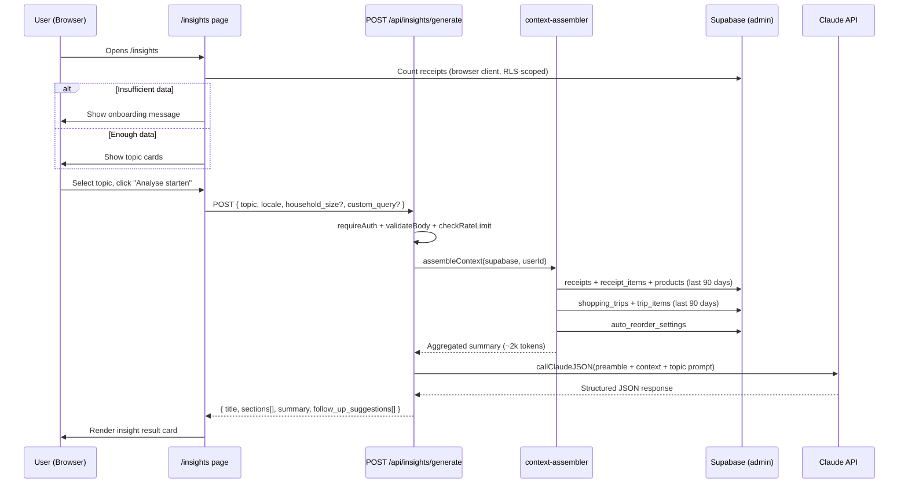
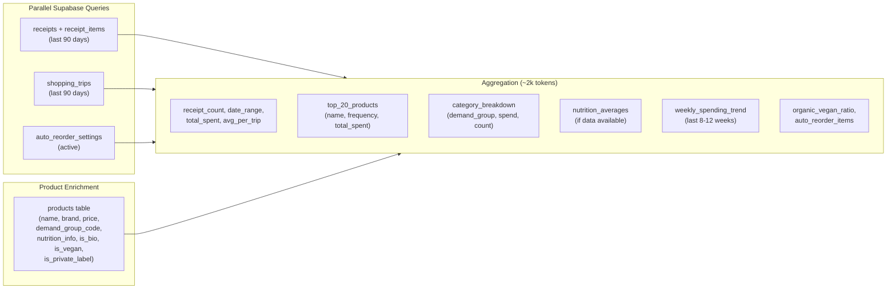

# F24 ALDI Insights Implementation Plan

> Feature spec: [FEATURES-INSIGHTS.md](../FEATURES-INSIGHTS.md)
> Created: 2026-03-29
> Implemented: 2026-03-29
> Status: Implemented (MVP)

## Implementation Checklist

- [x] Step 1: Add `insights` namespace to `de.json` and `en.json` (31 keys each)
- [x] Step 2: Create `src/lib/insights/types.ts` with InsightTopic, request Zod schema, response Zod schema (runtime validation), and TS types
- [x] Step 3: Create context assembler (split into 3 files: `context-assembler.ts`, `context-queries.ts`, `format-context.ts`)
- [x] Step 4: Create 7 prompt files: shared-preamble + 6 topic prompts (savings, health, nutrition, spending, habits, custom)
- [x] Step 5: Create `src/app/api/insights/generate/route.ts` with maxDuration, auth, validation, rate-limit, try/catch, topic-to-prompt mapping
- [x] Step 6: Create `page.tsx` (server) + `insights-client.tsx` (client) with auth-wait, AbortController, error recovery, cooldown, client-side custom validation
- [x] Step 7: Create `topic-card.tsx` and `insight-result.tsx` components
- [x] Step 8: Add Insights to AppShell desktop nav; extract `mobile-header.tsx` from `page.tsx`, add Insights icon there
- [x] Step 9: Write context-assembler tests (28 tests: happy path, sparse, empty, malformed nutrition_info, truncation, schema validation, topic mapping)
- [x] Step 10: `npx tsc --noEmit` (0 errors) and `npx vitest run` (1231 tests, 125 files, 0 failures)

---

## 1. Architecture Overview



## 2. File Plan

### 2a. New Files (16)

| File | Lines | Purpose |
| --- | --- | --- |
| `src/lib/insights/types.ts` | ~50 | Types + Zod schemas for both request AND response (runtime validation) |
| `src/lib/insights/context-assembler.ts` | ~220 | Aggregate user data; Promise.allSettled; defensive nutrition; hard truncation |
| `src/lib/insights/prompts/shared-preamble.ts` | ~40 | System prompt + context formatting |
| `src/lib/insights/prompts/savings-prompt.ts` | ~25 | "Gunstiger einkaufen" instructions |
| `src/lib/insights/prompts/health-prompt.ts` | ~25 | "Gesunde Ernahrung" instructions (topic enum: "nutrition") |
| `src/lib/insights/prompts/nutrition-prompt.ts` | ~25 | "Ernahrungsanalyse" with household_size (topic enum: "nutrition_analysis") |
| `src/lib/insights/prompts/spending-prompt.ts` | ~25 | "Ausgaben-Analyse" instructions |
| `src/lib/insights/prompts/habits-prompt.ts` | ~25 | "Einkaufsgewohnheiten" instructions |
| `src/lib/insights/prompts/custom-prompt.ts` | ~20 | Wraps free-text user question |
| `src/app/api/insights/generate/route.ts` | ~130 | maxDuration + auth + validation + rate-limit + try/catch + topic mapping |
| `src/app/[locale]/insights/page.tsx` | ~15 | Server component wrapper |
| `src/app/[locale]/insights/insights-client.tsx` | ~270 | Client state: auth-wait, AbortController, error recovery, cooldown |
| `src/components/insights/topic-card.tsx` | ~50 | Reusable topic selection card |
| `src/components/insights/insight-result.tsx` | ~80 | Result display with sections + follow-up chips |
| `src/components/layout/mobile-header.tsx` | ~80 | Extracted from page.tsx (currently 408 lines, violates 300-line rule) |
| `src/lib/insights/__tests__/context-assembler.test.ts` | ~180 | Unit tests: context assembly, response schema, topic mapping |

### 2b. Modified Files (4)

| File | Change |
| --- | --- |
| `src/components/layout/app-shell.tsx` | Add `{ href: "/insights", label: tInsights("navLabel"), match: ... }` to `navItems` array |
| `src/app/[locale]/page.tsx` | Extract mobile header into `mobile-header.tsx`; import it; add Insights icon in the extracted header |
| `src/messages/de.json` | Add `"insights": { ... }` namespace with ~28 keys |
| `src/messages/en.json` | Add `"insights": { ... }` namespace with ~28 keys |

**Scope note:** 20 total files (16 new + 4 modified), but 7 are small prompt templates (20-25 lines each). The `mobile-header.tsx` extraction is a code-quality refactor that reduces `page.tsx` from 408 to ~330 lines. Substantive new logic lives in 4 files: `context-assembler.ts`, `route.ts`, `insights-client.tsx`, and the test file.

## 3. Implementation Steps

**Step order:** i18n strings (Step 1) must be done before any UI code that uses `useTranslations("insights")` (Steps 6-8).

### Step 1: i18n Strings

New `"insights"` namespace in both `de.json` and `en.json`. Key strings:

- `navLabel` -- "Insights" / "Insights"
- `pageTitle` -- "ALDI Insights" / "ALDI Insights"
- `subtitle` -- "Was mochtest du uber dein Einkaufsverhalten erfahren?"
- `topicSavings`, `topicSavingsDesc` -- Savings topic
- `topicHealth`, `topicHealthDesc` -- Healthy eating topic
- `topicNutrition`, `topicNutritionDesc` -- Nutrition analysis topic
- `topicSpending`, `topicSpendingDesc` -- Spending analysis topic
- `topicHabits`, `topicHabitsDesc` -- Shopping habits topic
- `customLabel`, `customPlaceholder` -- Custom question input
- `generateButton` -- "Analyse starten" / "Start analysis"
- `cooldownButton` -- "Bitte warten ({seconds}s)" / "Please wait ({seconds}s)"
- `newAnalysis` -- "Neue Analyse" / "New analysis"
- `followUp` -- "Nachfragen" / "Follow up"
- `loading` -- "Analyse wird erstellt..." / "Generating analysis..."
- `errorUnavailable` -- "Insights sind gerade nicht verfügbar..."
- `onboardingTitle` -- "Noch zu wenig Daten..."
- `onboardingHint` -- "Nach ~3 Einkaufen mit Kassenzettel..."
- `onboardingScanButton` -- "Kassenzettel scannen"
- `privacyNote` -- "Deine Daten werden nur fur diese Analyse verwendet..."
- `sparseDataHint` -- "Mehr Kassenzettel = bessere Insights"
- `nutritionGapHint` -- "Nahrwertdaten werden laufend erganzt"
- `householdSizeLabel` -- "Haushaltsgrose" / "Household size"
- `householdSizeUnit` -- "Personen" / "People"
- `retryButton` -- "Erneut versuchen" / "Try again"
- `errorRateLimit` -- "Du hast zu viele Analysen angefordert. Versuche es spater." / "Too many analyses requested. Try again later."

### Step 2: Types and Validation Schema (`src/lib/insights/types.ts`)

Define shared types, Zod request schema, AND Zod response schema for runtime validation of Claude output:

```typescript
export const INSIGHT_TOPICS = ["savings", "nutrition", "nutrition_analysis", "spending", "habits", "custom"] as const;
export type InsightTopic = typeof INSIGHT_TOPICS[number];

// --- Request validation (server-side, via validateBody) ---
export const insightRequestSchema = z.object({
  topic: z.enum(INSIGHT_TOPICS),
  custom_query: z.string().min(1).max(500).optional(),
  locale: z.enum(["de", "en"]),
  household_size: z.number().int().min(1).max(8).optional(),
}).refine(
  (d) => d.topic !== "custom" || (d.custom_query?.trim().length ?? 0) > 0,
  { message: "custom_query required for custom topic", path: ["custom_query"] }
);

// --- Response validation (runtime check on Claude JSON output) ---
// Claude commonly returns `null` for fields it considers empty (not `undefined`).
// Use `.nullish()` / `.nullable().transform()` to handle both null and undefined.
const insightSectionSchema = z.object({
  content: z.string(),
  suggested_product_name: z.string().nullish(),
});

export const insightResponseSchema = z.object({
  title: z.string(),
  sections: z.array(insightSectionSchema),
  summary: z.string(),
  follow_up_suggestions: z.array(z.string()).nullable().transform(v => v ?? []),
});

export type InsightSection = z.infer<typeof insightSectionSchema>;
export type InsightResponse = z.infer<typeof insightResponseSchema>;

// --- Topic-to-prompt mapping (explicit, tested) ---
export const TOPIC_PROMPT_MAP: Record<InsightTopic, string> = {
  savings: "savings",
  nutrition: "health",            // enum "nutrition" -> health-prompt.ts
  nutrition_analysis: "nutrition", // enum "nutrition_analysis" -> nutrition-prompt.ts
  spending: "spending",
  habits: "habits",
  custom: "custom",
};
```

**Key decisions:**

- `suggested_product_id` is omitted from MVP. Claude does not receive product UUIDs in context (they consume tokens and Claude cannot reliably map them). The "add to list" buttons are therefore excluded from the MVP result card.
- Response Zod schema provides **runtime validation** of Claude's JSON output. `callClaudeJSON<T>` uses `as T` (type assertion only), so without runtime checks, malformed Claude output (e.g., `sections` as a string instead of array) would silently pass and crash the client on `.map()`. This mirrors the `cook-chat` pattern which uses `aiCookResponseSchema.safeParse()`.

### Step 3: Context Assembler (`src/lib/insights/context-assembler.ts`)

Core data aggregation function. Uses admin Supabase client with explicit `user_id` filtering (same pattern as `process-receipt`, `cook-chat`).

**Key function:** `assembleInsightContext(supabase: SupabaseClient, userId: string): Promise<UserShoppingContext>`

**Data flow:**



**Aggregation output shape:**

```typescript
interface UserShoppingContext {
  receipt_count: number;
  date_range: { from: string; to: string };
  total_spent: number;
  avg_per_trip: number;
  shopping_frequency_per_week: number;
  top_products: { name: string; count: number; total_spent: number }[];
  category_breakdown: { group: string; spent: number; items: number }[];
  nutrition_summary?: { avg_calories?: number; protein_ratio?: number; /* ... */ };
  weekly_spending: { week: string; amount: number }[];
  organic_ratio: number;
  vegan_ratio: number;
  auto_reorder_items: { name: string; interval: string }[];
  trip_count: number;
}
```

**Parallel queries use `Promise.allSettled` (not `Promise.all`):**

Receipts, trips, and auto_reorder are fetched in parallel. If the trips query fails (e.g., schema mismatch), the others still succeed. Each settled result is checked individually:

```typescript
const [receiptsResult, tripsResult, autoReorderResult] = await Promise.allSettled([
  fetchReceipts(supabase, userId),
  fetchTrips(supabase, userId),
  fetchAutoReorder(supabase, userId),
]);
const receipts = receiptsResult.status === "fulfilled" ? receiptsResult.value : [];
const trips = tripsResult.status === "fulfilled" ? tripsResult.value : [];
const autoReorder = autoReorderResult.status === "fulfilled" ? autoReorderResult.value : [];
// Log rejections as warnings, never crash the whole assembler
```

**Token discipline with hard enforcement:** The `formatContextForPrompt` function caps sections at: `top_products` 20, `category_breakdown` top 10, `weekly_spending` last 12, `auto_reorder_items` 10. After formatting, if the output exceeds **8,000 characters** (~2,200 tokens), it truncates the least-important sections in order: `auto_reorder_items` -> `weekly_spending` -> bottom of `category_breakdown` -> bottom of `top_products`. A `log.warn` is emitted when truncation occurs.

**Product enrichment:** Receipt items are joined with `products` (via `product_id`) and `competitor_products` (via `competitor_product_id`) to get `name`, `demand_group_code`, `nutrition_info`, `is_bio`, `is_vegan`, `is_private_label`. Auto-reorder settings also require a join with `products` (via `product_id`) to get product names. This is done in a single batch query per table.

**Defensive `nutrition_info` parsing:** The JSONB column is typed as `Json | null` in Supabase. The actual structure is `NutritionInfo` from `src/lib/product-photo-studio/types.ts` (`energy_kcal`, `fat`, `carbs`, `protein`, `salt`, etc.), but products may have differently-shaped or empty data. Each field is extracted with runtime type guards (`typeof n.energy_kcal === "number"` pattern from `extract-product-info.ts`), never assumed to conform to the interface. Products with no parseable nutrition data are counted and excluded from nutrition averages.

### Step 4: Prompt Templates (`src/lib/insights/prompts/`)

**`shared-preamble.ts`** exports `buildSystemPrompt(context: string, locale: string): string`:

```typescript
export function buildSystemPrompt(context: string, locale: string): string {
  const lang = locale === "de" ? "German" : "English";
  return `You are a personal shopping analyst for a grocery customer (primarily ALDI).
You have access to the customer's shopping data summary below.
Always respond in ${lang}.
Never invent data not present in the context.
If data is insufficient for a specific analysis, say so honestly.

IMPORTANT: Respond ONLY with a JSON object in this exact format:
{
  "title": "...",
  "sections": [{ "content": "..." }, ...],
  "summary": "...",
  "follow_up_suggestions": ["...", "..."]
}

CUSTOMER DATA:
${context}`;
}
```

Each topic prompt exports `buildUserPrompt(locale: string, householdSize?: number): string` returning the user message with topic-specific analysis instructions. Example for savings:

```typescript
export function buildSavingsUserPrompt(locale: string): string {
  return locale === "de"
    ? `Analysiere meine Einkaufe und finde Sparpotenziale. Identifiziere teurere Produkte, fur die es gunstigere ALDI-Eigenmarken gibt. Berechne geschatztes monatliches Sparpotenzial. Gib 3-5 konkrete Tipps.`
    : `Analyze my purchases and find savings potential. Identify expensive products that have cheaper ALDI private-label alternatives. Calculate estimated monthly savings. Give 3-5 concrete tips.`;
}
```

### Step 5: API Route (`src/app/api/insights/generate/route.ts`)

Follows the `cook-chat` and `match-ingredients` patterns, with fixes for all critical review findings:

```typescript
export const maxDuration = 60; // Context assembly + Claude call can take 30-50s

const INSIGHTS_UNAVAILABLE = {
  error: "Insights sind gerade nicht verfugbar. Bitte versuche es spater.",
} as const;

export async function POST(request: Request) {
  // 1. Validate body (before auth -- consistent with cook-chat/match-ingredients pattern)
  const validated = await validateBody(request, insightRequestSchema);
  if (validated instanceof NextResponse) return validated;

  // 2. Auth
  const auth = await requireAuth(request);
  if (auth instanceof NextResponse) return auth;

  // 3. API key check
  const apiKey = requireApiKey();
  if (apiKey instanceof NextResponse) return apiKey;

  // 4. Rate limit (shared claudeRateLimit -- 50/hour/user, same pool as other Claude endpoints)
  const identifier = getIdentifier(request, auth.user.id);
  const rateLimited = await checkRateLimit(claudeRateLimit, identifier);
  if (rateLimited) return rateLimited;

  // 5. Admin client
  const supabase = requireSupabaseAdmin();
  if (supabase instanceof NextResponse) return supabase;

  try {
    // 6. Assemble context
    const context = await assembleInsightContext(supabase, auth.user.id);

    // 7. Build prompt (explicit topic-to-prompt mapping via TOPIC_PROMPT_MAP)
    const contextText = formatContextForPrompt(context);
    const systemPrompt = buildSystemPrompt(contextText, validated.locale);
    const userPrompt = getTopicPrompt(validated.topic, validated.locale, validated.household_size);

    // 8. Call Claude
    const raw = await callClaudeJSON<unknown>({
      model: CLAUDE_MODEL_SONNET,
      system: systemPrompt,
      messages: [{ role: "user", content: userPrompt }],
      max_tokens: 1500,
      temperature: 0.4,
    });

    // 9. Runtime-validate Claude's response against Zod schema
    const parsed = insightResponseSchema.safeParse(raw);
    if (!parsed.success) {
      log.error("[insights] Claude response validation failed:", parsed.error.message);
      return NextResponse.json(INSIGHTS_UNAVAILABLE, { status: 500 });
    }

    return NextResponse.json(parsed.data);
  } catch (err) {
    log.error("[insights] Generation failed:", err);
    return NextResponse.json(INSIGHTS_UNAVAILABLE, { status: 500 });
  }
}
```

**Key fixes from code review:**

- `maxDuration = 60` -- without this, Vercel's default 10-15s timeout causes guaranteed production failures.
- `try/catch` around steps 6-9 -- context assembly failures, Claude errors (ClaudeApiError), and parse failures all return a safe 500. No PII, no stack trace in client response.
- `callClaudeJSON<unknown>` + `insightResponseSchema.safeParse()` -- runtime validation of Claude output, not just a TypeScript type assertion. Prevents `sections.map is not a function` crashes if Claude returns malformed JSON.
- `TOPIC_PROMPT_MAP` from `types.ts` drives the `getTopicPrompt` routing, ensuring the confusing `"nutrition" -> health-prompt / "nutrition_analysis" -> nutrition-prompt` mapping is explicit and testable.

**Note on `claudeRateLimit` sharing:** This limiter (50/hour) is shared with `process-receipt`, `match-ingredients`, `assign-category`, and `cook-chat`. A user who scans 40 receipts in an hour has only 10 insight calls remaining. This is acceptable for MVP; the 429 error message is generic ("Rate limit exceeded").

### Step 6: Insights Page

**`page.tsx`** (server component): Minimal wrapper that imports `InsightsClient`.

```typescript
export default function InsightsPage() {
  return <InsightsClient />;
}
```

**`insights-client.tsx`** (client component): Main state machine.

**States:**

- `checking` -- Initial state while auth loads and data count is fetched
- `idle` -- Topic selection visible (landing)
- `loading` -- Spinner shown, ALL buttons disabled
- `result` -- InsightResult component visible with response data
- `error` -- Error message shown with "Try again" button
- `onboarding` -- Insufficient data message

**Key behaviors (with all review fixes applied):**

- **Locale:** Read current locale via `useLocale()` from `next-intl` (needed for the request body).
- On mount: **wait for `useAuth().loading === false`** before doing anything. Without this, `auth.uid()` is null during Supabase's async `getSession()`, and the receipt count query returns 0 (RLS filters by `user_id = auth.uid()::text`), falsely triggering the onboarding state on every cold navigation.

```typescript
const { user, loading: authLoading } = useAuth();
const locale = useLocale();
useEffect(() => {
  if (authLoading || !user) return;
  checkDataAvailability();
}, [authLoading, user]);
```

- **`checking` state UI:** Renders a centered spinner (same pattern as other loading states). If the receipt count query itself fails (Supabase down, network error), fall through to `idle` (show topics) with a `log.warn`. Failing gracefully is better than blocking the page -- the server-side route has its own data access.
- Data check: count receipts via browser Supabase client. RLS on receipts is properly scoped (`user_id = auth.uid()::text` per migration `20260226100000`), so no explicit `user_id` filter needed on the browser client. Query: `.from("receipts").select("*", { count: "exact", head: true }).gte("purchase_date", cutoff90days)`
- **Minimum data threshold: receipts < 3 (no trip check).** If receipts < 3: set `onboarding` state; show CTA link to `/capture`. If receipts >= 3: set `idle`.
- On topic select: highlight selected card
- **Button disabled** when `state !== "idle"` OR (`topic === "custom"` AND `custom_query` is empty/whitespace). Client-side validation prevents empty custom submits without a server round-trip.
- On "Analyse starten" click: set `loading`, create `AbortController`, POST to API with `signal`
- **AbortController cleanup:** On component unmount, "Neue Analyse" click, OR new generation request, abort the in-flight fetch. This prevents both wasting Claude credits AND stale results overwriting the `idle` state.
- **`fetch()` response handling:** `fetch()` does NOT throw on 4xx/5xx -- only on network errors. Must check `!res.ok` explicitly. Pattern from existing codebase (`CookChat.tsx`, `RecipeImportFlow.tsx`):

```typescript
const abortRef = useRef<AbortController | null>(null);

const handleGenerate = async () => {
  abortRef.current?.abort();
  const controller = new AbortController();
  abortRef.current = controller;
  setState("loading");
  try {
    const res = await fetch("/api/insights/generate", {
      method: "POST",
      headers: { "Content-Type": "application/json" },
      body: JSON.stringify({ topic, custom_query: customQuery, locale, household_size: householdSize }),
      signal: controller.signal,
    });

    if (!res.ok) {
      if (res.status === 429) {
        setErrorMessage(t("errorRateLimit"));
      } else {
        setErrorMessage(t("errorUnavailable"));
      }
      setState("error");
      return;
    }

    const data = await res.json() as InsightResponse;
    setResult(data);
    setState("result");
    startCooldown();
  } catch (e) {
    if (e instanceof DOMException && e.name === "AbortError") return;
    setErrorMessage(t("errorUnavailable"));
    setState("error");
  }
};

const handleNewAnalysis = () => {
  abortRef.current?.abort(); // cancel in-flight request to prevent stale result overwrite
  setState("idle");
};

useEffect(() => () => abortRef.current?.abort(), []);
```

- On success: set `result` with response data; start 10s cooldown timer (use `useRef` for timer ID, clear in cleanup to avoid stale closure issues)
- On error: set `error` with user-friendly message AND a **"Erneut versuchen" / "Try again" button** that resets to `idle`. Without this, the user is stuck.
- On 429: show rate-limit-specific message from i18n (`errorRateLimit`)
- On "Neue Analyse": **abort in-flight request** + reset to `idle`
- On follow-up chip click: set topic to `custom`, **pre-fill `custom_query`** and **scroll to the text input** -- do NOT auto-submit. The spec (section 3.4) says "allowing follow-up questions", meaning the user can edit before sending.

**Household size:** `localStorage` key `insights_household_size`. Default: 2. Shown as a number stepper (1-8) only when `nutrition_analysis` topic is selected. Persisted on change.

**Sparse data disclaimer:** If receipts 3-5 (borderline), show a small banner: "Mehr Kassenzettel = bessere Insights" with a link to scan receipts.

**Privacy disclaimer:** Small text at bottom of landing state: "Deine Daten werden nur fur diese Analyse verwendet und nicht gespeichert."

**Refresh behavior:** Ephemeral by design. Refreshing the page returns to topic selection. No attempt to persist results in state or URL.

### Step 7: UI Components

**`topic-card.tsx`:** Clickable card with icon, title, description. Props: `{ icon, title, description, selected, onClick }`. Uses Tailwind with `ring-2 ring-aldi-blue` when selected.

**`insight-result.tsx`:** Renders `InsightResponse`. Sections as styled paragraphs. Summary in a highlighted box. Follow-up suggestions as rounded chip buttons (clicking pre-fills custom input, does NOT auto-submit). "Neue Analyse" button at bottom. Error state includes a "Erneut versuchen" / "Try again" button.

### Step 8: Navigation Integration

**`app-shell.tsx`** (desktop nav): Add entry to `navItems` array after Receipts:

```typescript
{ href: "/insights" as const, label: tInsights("navLabel"), match: (p: string) => p.startsWith("/insights") },
```

This requires adding `const tInsights = useTranslations("insights");` at the top.

**`page.tsx`** (mobile header extraction + Insights icon):

`page.tsx` is currently 408 lines, violating the 300-line coding standard. As part of adding the Insights icon, extract the mobile header (lines ~240-304) into `src/components/layout/mobile-header.tsx`. The extracted component uses its own `useTranslations` hooks (it's inside the same provider tree) and receives only the store detection values (`detectedStoreName`, `unknownLocation`) as props, since the parent also uses `useStoreDetection()`. The `invEnabled` flag and translation hooks are called directly inside the extracted component. The extraction reduces `page.tsx` to ~330 lines.

In the extracted `mobile-header.tsx`, add an Insights icon link (lightbulb SVG) after the Flyer icon and before Settings, same pattern as the existing icons.

**Mobile crowding fix (decided):** The mobile header has 7 icons (Catalog, Recipes, Receipts, Flyer, Insights, Settings) plus the app name. The existing icons already hide their label text on mobile (`hidden md:inline` spans). The Insights icon follows the same pattern -- icon-only on mobile, label visible on `md:` breakpoint and up. The icons themselves are 22x22px in `touch-target` containers, which fit 7 icons at 320px (7 x 44px = 308px + app name uses `flex-1`).

**Prerequisite:** Step 1 (i18n strings) must be completed before this step, because `useTranslations("insights")` requires the namespace to exist.

## 4. State and Data Flow

**Data originates:** Supabase tables `receipts`, `receipt_items`, `products`, `competitor_products`, `shopping_trips`, `trip_items`, `auto_reorder_settings`.

**Data transforms:** `context-assembler.ts` queries, joins, aggregates, and formats into a compact text summary.

**Data persists:** Nowhere for the analysis output (ephemeral per spec). `household_size` persists in `localStorage` only.

**Race conditions mitigated:**

- Client double-click: button is `disabled` in all states except `idle`. Additionally, `abortRef.current?.abort()` cancels any in-flight request before starting a new one.
- Auth loading race: receipt count check is gated on `authLoading === false && user !== null`.
- Stale result on "Neue Analyse": clicking "Neue Analyse" aborts the in-flight request (`abortRef.current?.abort()`), preventing a late-arriving result from overwriting the `idle` state.
- Server-side: each POST is stateless. `claudeRateLimit` enforces 50/hour/user across all Claude endpoints.

## 5. Edge Cases Checklist

- **Empty/null states:** User with 0 receipts sees onboarding; context assembler returns valid (empty) structure. Topic selection requires a selection before "generate" button is enabled. Custom topic requires non-empty `custom_query` (client-side validation, not just server Zod).
- **Boundary values:** `household_size` clamped to 1-8 by Zod. `custom_query` max 500 chars. Weekly spending array capped at 12 entries. Context text hard-capped at 8,000 chars.
- **Partial failure:** Context assembler uses `Promise.allSettled` -- if trips query fails, receipts and auto_reorder still proceed. Rejected results are logged as warnings, not thrown. If Claude fails, route returns 500 with generic message via try/catch.
- **Auth/RLS:** Server uses admin client with explicit `user_id = auth.user.id` filtering (admin bypasses RLS). Client-side count check uses browser Supabase client, which has properly scoped RLS (`user_id = auth.uid()::text` per migration `20260226100000_rls_user_filtering.sql`). No cross-user data exposure in either path.
- **Auth loading race:** Client waits for `useAuth().loading === false` before querying receipt count. Without this gate, `auth.uid()` is null during session initialization, and RLS returns 0 rows, falsely showing onboarding.
- **Concurrency / double-click:** Button disabled in all states except `idle`. `AbortController` cancels in-flight requests before starting new ones. Rate limit applies per user across tabs.
- **Navigation away:** `AbortController` aborts the fetch on component unmount (cleanup in `useEffect`). Prevents wasting Claude credits for abandoned requests.
- **Offline:** Insights requires network (Claude API). If offline, the fetch fails; client shows "unavailable" error with retry button. Core offline shopping list is unaffected.
- **Migration safety:** N/A -- no new Supabase migrations.
- **i18n:** All user-facing strings in `de.json` + `en.json` under `insights` namespace. Page works on both `/de/insights` and `/en/insights`.
- **Mobile:** Topic cards stack vertically on narrow viewports. Touch targets >= 44px. Works on 320px viewport. Mobile header uses icons-only (label text hidden via existing `hidden md:inline` pattern). 7 icons x 44px touch-target = 308px, fits 320px viewport.
- **Loading/error states:** Loading spinner during generation. Error state includes "Try again" button (resets to `idle`). 429 shows rate-limit-specific message. Cooldown timer on button after success. Timer cleanup via `useRef` to avoid stale closures.
- **No nutrition data:** If products lack `nutrition_info`, the `nutrition_summary` in context is omitted. Products with malformed/non-conforming JSONB are silently skipped (defensive parsing). For `nutrition_analysis` topic, Claude is instructed to note data gaps. UI shows `nutritionGapHint` string.
- **Malformed Claude response:** `insightResponseSchema.safeParse()` catches invalid JSON structure (e.g., `sections` as string instead of array). Returns 500 with safe message instead of passing bad data to the client.
- **Very old data only:** If all receipts are > 6 months old, context assembler includes date range; Claude is instructed to note staleness.
- **Page refresh:** Results are ephemeral. Refreshing returns to topic selection. This is by design (no persistence).

## 6. Regression Risk Assessment

| Existing Feature | Risk | Mitigation |
| --- | --- | --- |
| Shopping list / search / add | None | Insights only reads data, adds no new writes |
| Receipt pipeline | None | No changes to `parse-receipt.ts`, `receipt-service.ts`, or receipt API routes |
| Catalog / Flyer | None | No changes to these modules |
| Recipes / cook-chat | Low | Shares `claudeRateLimit` (50/hour) pool; heavy receipt scanning + insights could exhaust budget |
| Auth flow | None | Insights uses existing `requireAuth`; no auth logic changes |
| Settings / sync | None | No dependency on settings module except reading `household_size` from localStorage |
| Desktop nav (AppShell) | Low | Adding one entry to `navItems` array; verify active state highlighting |
| Mobile header (page.tsx) | Low | Extracting mobile header into separate component; verify no prop regressions |
| i18n | None | Additive namespace; existing keys untouched |
| Dexie / offline sync | None | No new IndexedDB tables or sync changes; Insights is server-only |

## 7. Test Plan

### Unit Tests (`src/lib/insights/__tests__/context-assembler.test.ts`)

**Context assembler tests:**

1. **Happy path:** Mock Supabase returning 5 receipts with items, 3 trips, 2 auto-reorder settings. Verify:
   - Output has all expected fields
   - `top_products` capped at 20
   - `weekly_spending` has entries
   - Formatted text is under 8,000 characters
2. **Sparse data:** 1 receipt with 2 items, 0 trips. Verify:
   - Output is valid (no crashes)
   - `top_products` has 2 entries
   - `trip_count` is 0
3. **No nutrition data:** Products lack `nutrition_info`. Verify:
   - `nutrition_summary` is undefined/null
   - No error thrown
4. **Malformed nutrition_info:** Products have `nutrition_info: { random_field: "abc" }` or `nutrition_info: "string"`. Verify:
   - Defensive parsing skips these products
   - No error thrown
   - `nutrition_summary` excludes them from averages
5. **Empty user:** 0 receipts, 0 trips. Verify:
   - Returns valid empty structure
   - `receipt_count` is 0, `total_spent` is 0
6. **Partial query failure (Promise.allSettled):** Mock trips query rejection while receipts succeeds. Verify:
   - Function does not throw
   - `trip_count` is 0, receipt data is present
   - Warning is logged
7. **Token budget truncation:** Mock 100+ unique products across 20 demand groups. Verify:
   - Formatted text does not exceed 8,000 characters
   - Truncation removes `auto_reorder_items` first, then `weekly_spending`

**Zod schema tests:**

1. **Request schema:** Verify `insightRequestSchema` rejects:
   - Missing `topic`
   - Invalid topic value (e.g., `"invalid"`)
   - `custom` topic without `custom_query`
   - `custom` topic with empty/whitespace `custom_query`
   - `household_size` outside 1-8
   - Valid payloads pass (each topic, with/without optional fields)
2. **Response schema:** Verify `insightResponseSchema`:
   - Rejects `sections` as a string instead of array
   - Rejects missing `title`
   - Accepts empty `sections` array (Claude may return empty for sparse data)
   - Accepts `follow_up_suggestions: null` (transforms to `[]`)
   - Accepts `follow_up_suggestions` omitted entirely (transforms to `[]`)
   - Accepts `suggested_product_name: null` in sections (nullish)
   - Valid full response passes

**Topic mapping tests:**

1. **TOPIC_PROMPT_MAP:** Verify each topic resolves to the correct prompt file identifier. Specifically test that `"nutrition"` maps to `"health"` and `"nutrition_analysis"` maps to `"nutrition"`.

### Manual Testing

- Navigate to `/de/insights` and `/en/insights` -- verify rendering
- Desktop nav shows "Insights" with correct active state
- Mobile header shows lightbulb icon (verify on 320px viewport)
- Onboarding state visible with < 3 receipts
- Generate analysis for each topic -- verify result renders
- Follow-up chip pre-fills custom input (does NOT auto-submit)
- Error state shows "Try again" button that resets to idle
- Cooldown timer works (10s)
- Rate limit returns 429 with rate-limit-specific message
- No auth -> 401
- Navigate away during loading -> no console errors, no wasted credit on return
- Double-click "Analyse starten" -> only one API call fires

## 8. Decisions and Verified Facts

**Verified (resolved during planning):**

- `shopping_trips` and `trip_items` tables exist in the initial schema (`20250216000000_initial_schema.sql`). `trip_items` has `demand_group_code` (added in `20260303130000_bl62_demand_group_code_on_items.sql`). `shopping_trips.user_id` is TEXT (changed in `20260226000000_auth_account_migration.sql`).
- RLS policies on `receipts`, `receipt_items`, `shopping_trips`, `trip_items`, `auto_reorder_settings` are all properly scoped to `auth.uid()::text` (not `USING (true)` as originally assumed). See `20260226000000` and `20260226100000` migrations.
- `nutrition_info` JSONB structure follows `NutritionInfo` interface: `{ energy_kcal, fat, saturated_fat, carbs, sugar, fiber, protein, salt }` -- all `number | null`. Defined in `src/lib/product-photo-studio/types.ts`. Defensive parsing still required because not all products follow this shape.
- No new Supabase migration is needed -- Insights only reads existing tables.

**Assumptions (still held):**

- The existing `claudeRateLimit` (50/hour) is appropriate for Insights; no separate limiter needed.
- Claude Sonnet is the right model for cost/quality balance (~$0.005-0.015 per insight per spec).

**Resolved decisions:**

1. Minimum data threshold: **receipts < 3, no trip check.** Receipts are the primary data source for insights. Trips are secondary context, not required.
2. Mobile header crowding: **Icons-only on mobile** (label text uses existing `hidden md:inline` pattern). 7 icons fit at 320px (7 x 44px = 308px).

**Plan Confidence: HIGH** -- confirmed by implementation.

All planned fixes were implemented. Two additional issues found and resolved during implementation:
- `t` prop type mismatch between `useTranslations` return type and `InsightResult` component (fixed with `Record<string, string | number>`)
- `unknownLocation` is `GeoPosition | null`, not `boolean` (fixed with `!!` coercion in `MobileHeader` prop)

## Implementation Deviations from Plan

1. **Context assembler split into 3 files** (plan estimated 1 file at ~220 lines): `context-assembler.ts` (230 lines), `context-queries.ts` (191 lines), `format-context.ts` (96 lines) -- required by the 300-line coding standard.
2. **Topic card and insight result components created in Step 6** (plan had them in Step 7): necessary because `insights-client.tsx` imports them and each step must compile.
3. **31 i18n keys** instead of planned 28: the final set has 31 keys per language after including all UI states.
4. **28 tests** instead of planned 12: expanded coverage for nutrition parsing and Zod schema edge cases.

---

*Created: 2026-03-29*
*Implemented: 2026-03-29*
*Source: Cursor plan `f24_insights_implementation_ece0130f` -- 2 rounds of hostile code review applied*
